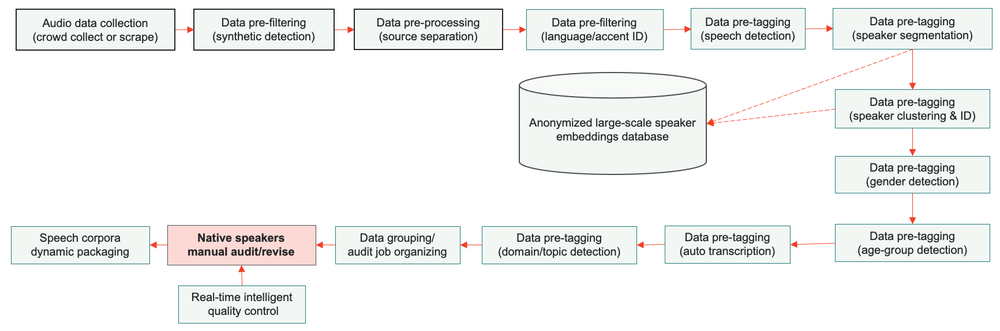

# About
This repository provides data and code for the paper:

**[Scalable Data Annotation Pipeline for High-Quality Large Speech Datasets Development](https://openreview.net/forum?id=-OFOwaDriw7)** (submitted to NeurIPS 2021 Track on Datasets and Benchmarks Round2)

**Authors**: Mingkuan Liu, Chi Zhang, Hua Xing, Chao Feng, Monchu Chen, Judith Bishop, Grace Ngapo

**Keywords**: speech processing, speech dataset, human in the loop, annotation pipeline, quality assurance, speech annotation

# Abstract
This paper introduces a human-in-the-loop (HITL) data annotation pipeline to generate high-quality, large-scale speech datasets. The pipeline combines human and machine advantages to more quickly, accurately, and cost-effectively annotate datasets with machine pre-labeling and fully manual auditing. Quality control mechanisms such as blind testing, behavior monitoring, and data validation have been adopted in the annotation pipeline to mitigate potential bias introduced by machine-generated labels. Our A/B testing and pilot results demonstrated the HITL pipeline can improve annotation speed and capacity by at least 80\% and quality is comparable to or higher than manual double pass annotation. We are leveraging this scalable pipeline to create and continuously grow ultra-high volume off-the-shelf (UHV-OTS) speech corpora for multiple languages, with the capability to expand to 10,000+ hours per language annually. Customized datasets can be produced from the UHV-OTS corpora using dynamic packaging. UHV-OTS is a long-term Appen project to support commercial and academic research data needs in speech processing. Appen will donate a number of free speech datasets from the UHV-OTS each year to support academic and open source community research under the CC-BY-SA license. We are also releasing the code of the data pre-processing and pre-tagging pipeline under the Apache 2.0 license to allow reproduction of the results reported in the paper. Code and data are available in https://github.com/Appen/UHV-OTS-Speech


**HITL speech corpora development system pipeline for UHV-OTS corpora**

# Reproduce the automated machine pre-labeling results reported in the paper

## 0. Experiment envirionments setup
We use docker to run all the experiments and data processing for the corpora construction. To illustrate the algorithms used in the automatic modules in our pipeline, we build this docker enveronment containing all the testing scripts or demo scripts of each module. After you git cloned this repo, please run the docker build command like in below.
```bash
cd UHV-OTS-Speech
docker build -t uhv-ots-speech-demo:cpu ./
```  
After the images has been built, please docker run the image in a container with GPU availability.
```bash
docker run -it uhv-ots-speech-demo:cpu /bin/bash
```
**Inside the container**, in `/opt/scripts`, there are several sub folder, each of which is the testing/demo scripts of a module.

## 1. Data pre-filtering: synthetic speech detection
We utlized the algorithm propposed in [Towards End-to-End Synthetic Speech Detection](https://arxiv.org/abs/2106.06341) and adopted the library and pre-trained models in authors's github [repo](https://github.com/ghuawhu/end-to-end-synthetic-speech-detection). The original work achieved synthetic speech detection EER as low as 2.16% on in-domain testing data and 1.95% on cross-domain data. We developped a simple demo script to run a part of the [ASVspoof2019](https://datashare.ed.ac.uk/handle/10283/3336) and give out the detection results and likelihood. 

If the full testing is needed please run the codes in original authors' [repo](https://github.com/ghuawhu/end-to-end-synthetic-speech-detection). Please download the ASVspoof 2019 and 2015 data by running following command **Inside the container**:
```bash
cd /opt/scripts/synthetic_detection
./download.sh
```
But if only want to see how the module is working, inside the container, please run the following command **Inside the container** to see how it works.
```bash
cd /opt/scripts/synthetic_detection
./run_demo.sh 
```  

## 2. Data pre-processing: music/vocal source separation

We utilized well performed [spleeter](https://github.com/deezer/spleeter) library for source separation. The spleeter is source separation library of [Deezer](https://www.deezer.com/) and was introduced in ["Spleeter: a fast and efficient music source separation tool with pre-trained models"](https://www.researchgate.net/publication/342429039_Spleeter_a_fast_and_efficient_music_source_separation_tool_with_pre-trained_models). We post the script to run this tool on web scraped audio files. To run the tool with sample file, please run following command **Inside the container**.
```bash
cd /opt/scripts/source_separation
./run_demo.sh
```  
The script will try to separate each audio in **./sample_aduio** folders into two files, one  **\*\_bgm.wav** one **\*\_speech.wav**, both in **mono 16kHz 16bit liner PCM wav** format. The rest of automatic processing will be performed on the  **\*\_speech.wav** file, which is considered to be the speech channel of original audio. 

## 3. Data pre-filtering: language/accent identification
We apply language identification to pre-filter the raw audio data and ensure that the data is correctly routed to the corresponding language data processing pipeline. We trained a language ID systme based on the x-vector, which was introduced in "[X-VECTORS: ROBUST DNN EMBEDDINGS FOR SPEAKER RECOGNITION](https://www.danielpovey.com/files/2018_icassp_xvectors.pdf)". The x-vector model was trained with the [VoxLingua107](https://arxiv.org/abs/2011.12998) dataset, and the language ID algorithm achieved 93% accuracy on the VoxLingua107 dev set. 

The language id module was developped based on the Kaldi recipe. The model and x-vectors have been prepared and stored in this folder, to run the test and get EER, please run the command in below, **Inside the container**:
```bash
cd /opt/scripts/language_id
./run_test.sh
```  
Accent identification is more challenging than language identification. We’ve  adopted  the  x-vector plus LDA/PLDA framework to detect twenty-two different English accents using proprietary data. Our current accent detection accuracy is 75%. The x-vector model and x-vectors of training and testing data were prepared and stored in this folder, same as LDA/PLDA classifier model. To check the performance, please run the command as in below **Inside the container**:
```bash
cd /opt/scripts/accent_id
./run_test.sh
```

## 4. Data pre-tagging: speech detection
This is the folder containing the demo scripts of speech segmentation. The speech segmentation in this folder is adopted from the InaSpeechSegmenter which was introduced in [AN OPEN-SOURCE SPEAKER GENDER DETECTION FRAMEWORK FOR MONITORING GENDER EQUALITY](https://hal.archives-ouvertes.fr/hal-01927560/document). We only used the speech detection module of it  and it's pretrained model, which can be found in the original authors' [repo](https://github.com/ina-foss/inaSpeechSegmenter).

The inaSpeechSegmenter system won the first place in the Music and/or Speech Detection in Music Information Retrieval Evaluation eXchange 2018 (MIREX 2018). This module also achieved 97.5\% detection accuracy with an average boundary mismatch of 97ms at Appen's proprietary testset. To run demo of this module, please run the following command **Inside the container**:
```bash
cd /opt/scripts/speech_detection
./run_demo.sh
```
You can check the output csv file in folder ./output

## 5. Data pre-tagging: speaker diarization
This is the speaker diarization system developed based on BUT's diarization system introduced in [Analysis of the BUT Diarization System for VoxConverse Challenge](https://arxiv.org/abs/2010.11718).

The speaker diarization framework generally involves an embedding stage followed by a clustering stage.

We tested the pipeline with [VoxConverse corpus](http://www.robots.ox.ac.uk/~vgg/data/voxconverse), which is an audio-visual diarization dataset consisting of over 50 hours of multi-speaker clips of human speech, extracted from videos collected on the internet.  The DER achieved on VoxConverse using the BUT system is 4.41%, which is consistent with the result in BUT's report.

To download the dataset, please run the command **Inside the container** as in following:
```bash
cd /opt/scripts/speaker_diarization
./download.sh
```
After the data downloading, please run the test on VoxConverse data by running the commands in below **Inside the container**:
```bash
cd /opt/scripts/speaker_diarization
./run_test.sh
```  

## 6. Data pre-tagging: speaker clustering & identification
We utlized an ECAPA-TDNN embedding algorithm introduced in [Ecapa-tdnn: Emphasized channel412attention,  propagation and aggregation in tdnn based speaker verification](https://arxiv.org/abs/2005.07143) to generate speaker embeddings, which is used for speaker identification. A pre-trained embedding model by [SpeechBrain toolkit](https://github.com/speechbrain/speechbrain) is adopted in our pipeline, which produces EER of 0.7\% on VoxCeleb 1 dataset.

Please download the VoxCeleb1 data and then run the test to check the system's performance **inside the container**
```bash
cd /opt/scripts/SpeakerSec/
./download.sh
./run_test.sh
```  

## 7. Data pre-tagging: gender detection
An x-vector embedding model plus Multi-layer Perceptron (MLP) classifier framework is implemented gender_detection folder. We used the x-vector model introduced in "[X-VECTORS: ROBUST DNN EMBEDDINGS FOR SPEAKER RECOGNITION](https://www.danielpovey.com/files/2018_icassp_xvectors.pdf)". 
The pretrained x-vector model was used to extract the x-vectors of training and test data for MLP. Our gender detection model achieved 99.85% accuracy on VoxCeleb1 testing set in [VoxCeleb: a large-scale speaker identification dataset](https://arxiv.org/abs/1706.08612). To run the test of gender detection and check results, please run the command **Inside the container**:

```bash
cd /opt/scripts/gender_detection
./run_test.sh
```  


## 8. Data pre-tagging: speech recognition/transcription
To run the experiments on Librispeech test-clean and test-other data with our own Chain model, please run the following command to download Librispeech data **inside the container**.
```bash
cd /opt/scripts/asr_kaldichain
./download_prepare_extract.sh
```

The test-clean and test-other data will be downloaded **inside the container**.

In this module, we trained our own ASR model using Kaldi toolkit introduced in "[The kaldi speech recognition toolkit](https://www.danielpovey.com/files/2011_asru_kaldi.pdf)", specifically using the chain model recipe introduced in "[Purely sequence-trained neural networks for ASR based on lattice-free MMI](https://www.danielpovey.com/files/2016_interspeech_mmi.pdf)", which can be found originally in Kaldi's [repo](https://github.com/kaldi-asr/kaldi). But we trained our model using 11 corpora at hand, including free public corpora, purchased corpora, and self owned corpora.

To run the test on Librispeech test-other and test-clean data with our trained model, please run the following command, **inside the container**.

```bash
cd /opt/scripts/asr_kaldichain
./run_test.sh
```  

## 9. Data pre-tagging: domain/topic detection
So far we adopted a pipeline of topic detection of Multi-label Text Classification using BERT introduced in [webpage](https://medium.com/huggingface/multi-label-text-classification-using-bert-the-mighty-transformer-69714fa3fb3d). It was developped by original author based on the [BERT](https://arxiv.org/abs/1810.04805). It applied BERT to the problem of multi-label text classification. We assembled the original scripts from the [repo](https://gist.github.com/kaushaltrivedi) to replicate the [Kaggle’s Toxic Comment Classification Challenge](https://www.kaggle.com/c/jigsaw-toxic-comment-classification-challenge) to benchmark BERT’s performance for the multi-label text classification.

To run the benchmark test, please run the following commands **inside the container**

```bash
cd /opt/scripts/topic_detection
./run_test.sh

```  

# UHV-OTS dataset format

Detailed exaplanation of UHV-OTS dataset format is [attached here](./datasetformat.md). 


# Sample codes to parse UHV-OTS dataset to Kaldi style format

# Speech Annotation Instruction

Detailed annotation guideline is [attached here](./AnnotationGuideline.md). 

# License

## Software license

The code and pre-trained models of our speech data pre-processing and pre-tagging pipeline are under the Apache 2.0 license to allow reproduction of the results reported in the paper. 

## Dataset license

The UHV-OTS speech corpora development is an ongoing, long-term Appen project to support commercial and academic research data needs for tasks related to speech processing.  

Dataset consumers can visit https://appen.com/off-the-shelf-datasets/ to order existing datasets or contact us to discuss their specific dataset needs. Appen will consolidate those needs and adjust our UHV-OTS delivery pipeline accordingly, to deliver datasets of highest demand.  

Appen will donate a number of free speech datasets from the UHV-OTS each year to support academic and open source community research under the CC-BY-SA license. These free datasets will be downloadable from Appen's https://appen.com/open-source-datasets/ website. The first batch of free available dataset will be released in late of 2021.  

# References
